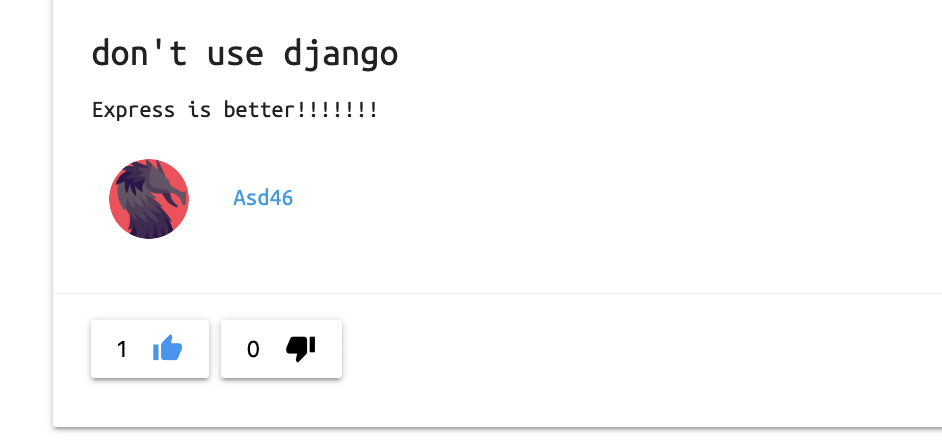
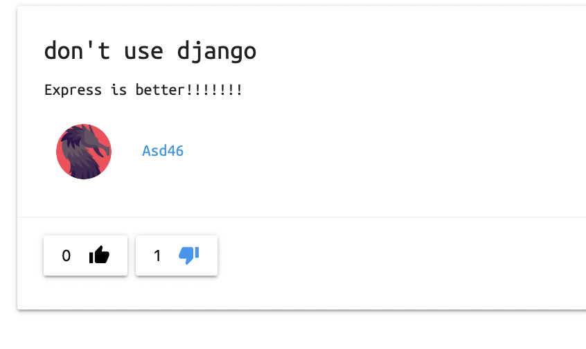
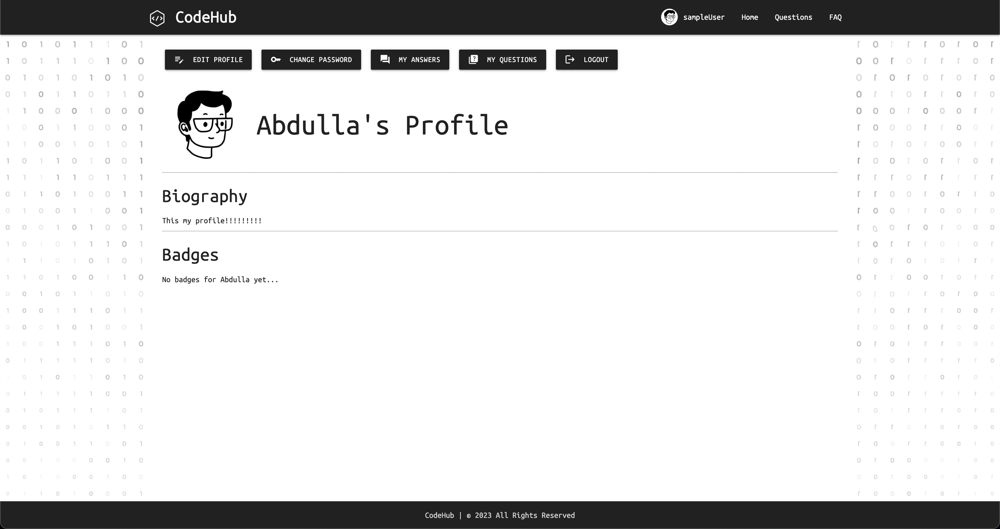
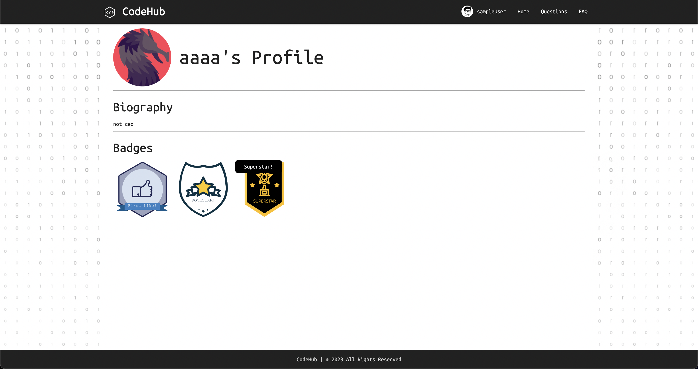

## Technologies Used
* Python
* SQL
* Django
* JavaScript CSS, HTML5, 
* Git + Github
* Materialize CSS Framework

## Packages used:
* Python Decouple
* Pillow
* Django Ckeditor
* Django Cleanup

## Instructions to use App

## 1- Sign Up
Fill in the Sign Up form

## 2- Sign In
Enter your Email Address and Password

<!-- insert screenshot -->

## 3- Pick Your Category: 
Choose either Frontend, Backend, or Command Line

<!-- insert screenshot -->

## 4- Ask a question
Either ask, answer, or scroll through a question of your choosing, or go to the Questions page and search for a specific question

<!-- insert screenshot -->

## 5- Answer a question

## 6- Reply to an Answer

## 7- Search for a question

## 8- Likes and top answer
Add a 'like' to your favorite answer to contribute to the community and have the best answers pinned on top.

<!-- insert screenshot -->

## 9- you can dislike the answer

## 10- You can view your profile at anytime through the Navbar, edit it, log out, change your password

<!-- insert screenshot -->

## 11- you can get a badge when your answer or reply get likes

## 12- you can find your own Questions

## Project Development

We first came together as a team brainstormed ideas and sketched some basic wireframes on paper. Later on we put some wireframes together through FIGMA, which included the ERD and the frontend. We used Trello to coordinate and assign tasks and track our progress.

## Code Examples

<!--  -->
<!-- insert screenshot -->

## Challenges

Merging conflicts / GitHUB

## Wins

Add a tool for the user to enable him to like and dislike the answer
Allocate a page to Frequently Asked Questions as a refrence for the user

## A couple paragraphs about the general approach you took
>>>>>
* 1- in used models  
 we built the structure of each factor such as category and question, answer, badge, profile through classes and some functions and provided clear and accurate insight and instructions to the server to perform also imported to support them 

* 2- in views.py
 we imported vital classes and models such : createview, UpdateView, DeleteView and Question, Category, Answer, Reply, Profile, Badges to support us build new classes and functions in order to inherit from them

A-we imported stuff to enable and ease login process for the user 
B- we imported crucial things to enable the user to browse from page to another
D-we imported important forms like: SignUpForm, UpdateProfileForm, UpdateUserForm and created functions to enable the user to sign up and update his profile 

* 3- in urls
 we connected the functions and models to pages to be shown to the user
A- we built catogery urls and connectted them to the pages
B- we built Questions urls and connectted them to the pages
C- we built Answer catogery urls and connectted them to the pages
D- we built reply urls and connectted them to the pages
E- we built auth urls and connectted them to the pages
F- we built profile urls and connectted them to the pages
G- we built badges urls and connectted them to the pages

* 4- in forms

 we imported user and profile in order to build the structer of the below forms to enable the user to sign up and update his profile 

A-SignUpForm
B-UpdateUserForm
C-UpdateProfileForm

* 5- in templates
Templates are responsible for showing the pages for the user
A- answer: is resposible for shoing the answers of question using Django Template
B- badges: is resposible for showing the badges 
C- Category: is resposible for enabling the user to choose the classification of the question
D- Main_app: is resposible for showing the badges 
E- profile: is resposible for showing the profile to the user and give him the oppurtinty to modify his profile
F- Question: is resposible for showing the question 
G- Registration: has the files that activate the browsing process including login and Sign up ,change password 
H- Reply: is resposible for showing the reply 

* 6- the migrations folder
this folder containes all the migrations we did in order to operate the functions and connect them to the server

* 7- the static 
this folder containes the styling pattern of the website and pictures , Javascript functions

* 8- .env
this file is to encrypt the values such as:
SecretKey
Debug
Engine

* 9- settings 
Settings file is already built in but we added and modified few things such as:
Databases
Login
CKeditor >>>> to install symbols and code version to the answer part

* 10- git ignore
we used it to avoid deploying some files to the website.

* 11- urls
connect the app to Git Hub
connect the accounts of users to the website 

## Installation instructions for any dependencies

* django-ckeditor==6.5.1
* django-ckeditor-5==0.2.4

we installed the above in order to upload the symbols set 

* django-cleanup==7.0.0

to allow the user deleting profile image

* Pillow==9.4.0

to allow user uploading profile pictures

* python-decouple==3.8

## Application Architecture
ERD:

## Wireframes:

## Users story:
Our users range from beginners/students, all the way up to the most seasoned senior developers. Every developed faces bugs, and 2 brains are always better than 1. CodeHub provides that platform for devs to co-operate and offer solutions to each other's problems.
