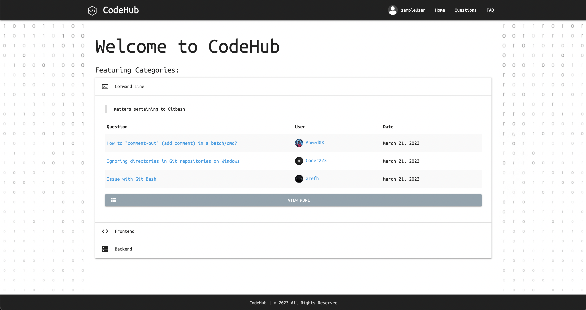
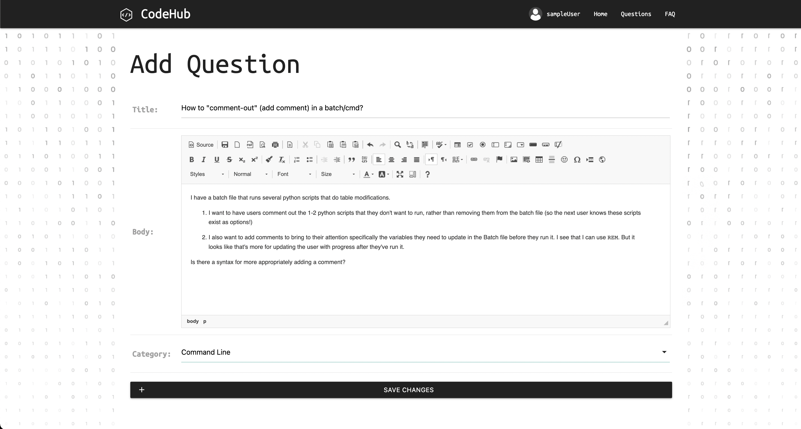

## Technologies Used
* Python
* SQL
* Django
* JavaScript CSS, HTML5, 
* Git + Github
* Materialize CSS Framework
* Python Decouple
* Pillow
* Django Ckeditor
* Django Cleanup

## Instructions to use App

## 1: Sign Up
Fill in the Sign Up form

## 2: Sign In
Enter your Email Address and Password

<!-- insert screenshot -->

## 3: Pick Your Category: 
Choose either Frontend, Backend, or Command Line

<!-- insert screenshot -->

## 4: User functions
Either ask, answer, or scroll through a question of your choosing, or go to the Questions page and search for a specific question

<!-- insert screenshot -->

## 5: Likes and top answer
Add a 'like' to your favorite answer to contribute to the community and have the best answers pinned on top.

<!-- insert screenshot -->

## 6: You can view your profile at anytime through the Navbar, and edit it.

<!-- insert screenshot -->

## : Project Development

We first came together as a team brainstormed ideas and sketched some basic wireframes on paper. Later on we put some wireframes together through FIGMA, which included the ERD and the frontend. We used Trello to coordinate and assign tasks and track our progress.
<!-- Add things here ^^  -->
ERD:

<!-- insert screenshot -->

## : Code Examples

<!--  -->
<!-- insert screenshot -->

## : Challenges

Merging conflicts / GitHUB

## : Wins
